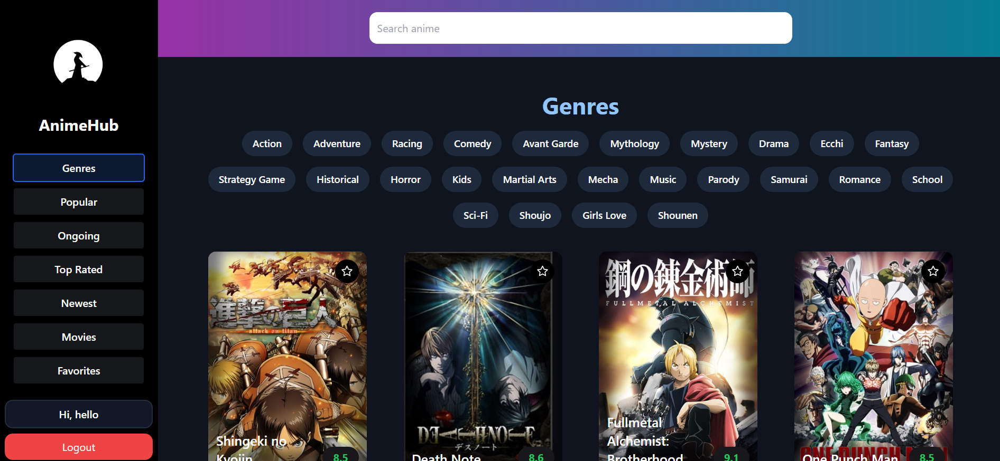
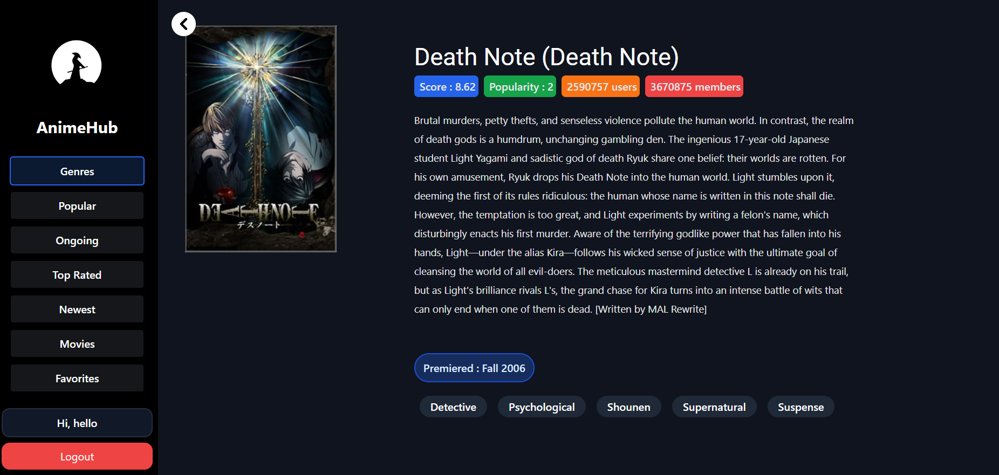

# AnimeHub
AnimeHub is a user-friendly and visually appealing anime website. It allows users to search for animes by title, sort them by genre, view popular, ongoing, top-rated, and newest anime. Additionally, users can create and manage their watchlist.






## Technologies Used
1. Tailwind CSS
2. ReactJS
3. NodeJS
4. ExpressJS
5. My SQL

## Features
1. User Authentication: Authentication is integrated to provide secure user registration and login functionality.
2. Anime Search: Users can search for animes by title, making it easy to find their favorite shows.
3. Genre Sorting: Animes can be sorted by genre, enabling users to discover new shows based on their preferences.
4. Popular, Ongoing, Top-Rated, and Newest Anime: Users can explore the latest trends, ongoing series, top-rated shows, and newest releases.
5. Watchlist: Users can create and manage their watchlist, keeping track of the animes they plan to watch.


## How to Contribute to this repository

#### Before contibuting create an issue of the bug or a feature you would like to add in the project and get the task assigned for youself.

1. Star the repository.
2. Fork the repository. (Click the Fork button in the top right of this page, click your Profile Image)
3. Clone the forked repository to your local machine.
```markdown
git clone https://github.com/your-username/AnimeHub.git
```
4. Change the present working directory.
```markdown
cd AnimeHub
```
5. Make a new branch
```markdown
git checkout -b branch-name
```
6. Import anime_hub database into MySQL Workbench
```
Open MySQL Workbench

Open the Local instance

Click Server->Data Import

Select Import from Self-Contained File option

Open AnimeHub\BackEnd\anime_hub_dump.sql

Press start import
```
7. Make .env file in .\AnimeHub\BackEnd just like .env.example and add your password.
7. Install node modules in BackEnd and start backend server.
```markdown
cd BackEnd
npm install
npm run start
```

8. Install node modules in FrontEnd and start frontend server.
```markdown
cd FrontEnd
npm install
npm run dev
```

9. Make change in the repository with the new branch.

10. Push the changes.
```markdown
git add .
git commit -m "Your commit Message"
git push origin branch-name
```
11.  Make a pull request on Github.

### Happy anime watching! 🍿


## Contributors
<a href="https://github.com/Peacexoom/AnimeHub/graphs/contributors">
  
</a>      